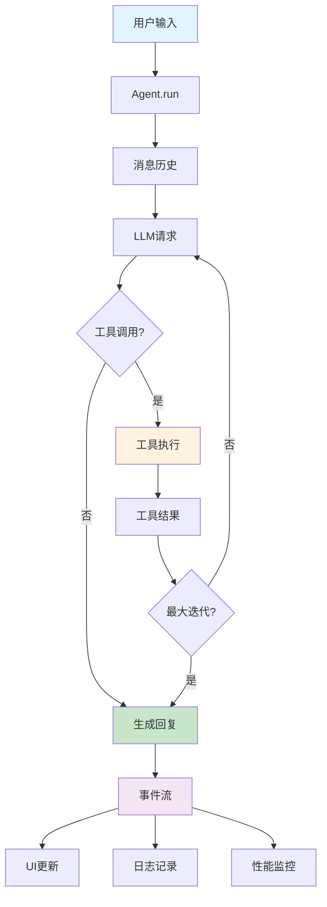

# @tarko/agent

## 简介

`@tarko/agent` 是一个事件流驱动的元 Agent 框架，专为构建高效的多模态 AI Agent 而设计。它提供了完整的 Agent 生命周期管理、工具集成和多模型支持。

## 何时使用？

此 Agent SDK 提供了低级别的编程 API，适用于从头构建 AI Agent：

- **MCP Agent**: 连接到 MCP 客户端，实现标准化的 AI 工具协议
- **GUI Agent**: 构建图形界面 Agent，处理用户交互
- **自定义 Agent**: 为特定领域构建专门的 Agent，如代码生成、数据分析等

与高级框架不同，`@tarko/agent` 给你完全的控制权来定制 Agent 行为。

## 架构概览



## 安装

```bash
npm install @tarko/agent
```

## 核心特性

1. **工具集成** - 在 Agent 响应中轻松创建和调用工具，支持复杂的多步骤工作流。
2. **事件流驱动** - 基于标准事件流协议，实时追踪 Agent 状态，高效构建上下文和 UI。
3. **原生流式** - 原生流式传输让你实时了解 Agent 的思考过程和输出结果。
4. **多模态分析** - 自动分析多模态工具结果（图像、文本、文件等），让你专注于业务逻辑。
5. **强大的扩展能力** - 丰富的生命周期 Hook 设计，允许你实现更高级的 Agent 行为。
6. **多 Model Provider** - 支持 OpenAI、Claude、豆包等多种模型，支持高级配置和运行时切换。
7. **多 Tool Call Engine** - `native`: OpenAI 兼容的原生函数调用；`prompt_engineering`: 基于提示的工具调用；`structured_outputs`: JSON Schema 结构化输出。

## 快速开始

创建 `index.ts`：

```ts
import { Agent, Tool, z, LogLevel } from '@tarko/agent';

const locationTool = new Tool({
  id: 'getCurrentLocation',
  description: "获取用户当前位置",
  parameters: z.object({}),
  function: async () => {
    return { location: 'Boston' };
  },
});

const weatherTool = new Tool({
  id: 'getWeather',
  description: '获取指定位置的天气信息',
  parameters: z.object({
    location: z.string().describe('位置名称，如城市名'),
  }),
  function: async (input) => {
    const { location } = input;
    return {
      location,
      temperature: '70°F (21°C)',
      condition: 'Sunny',
      precipitation: '10%',
      humidity: '45%',
      wind: '5 mph',
    };
  },
});

const agent = new Agent({
  model: {
    provider: 'openai',
    id: 'gpt-4o',
    apiKey: process.env.OPENAI_API_KEY!, // 从环境变量获取
  },
  tools: [locationTool, weatherTool],
  instructions: '你是一个专业的天气助手，能够获取准确的位置和天气信息。',
  temperature: 0.7,
  maxIterations: 50,
});

async function main() {
  const response = await agent.run({
    input: "今天天气怎么样？",
  });
  console.log(response);
}

main();
```

执行：

```bash
npx tsx index.ts
```

输出：

```json
{
  "id": "5c38c0a1-ccbe-48f0-8b97-ae78a4d9407e",
  "type": "assistant_message",
  "timestamp": 1750188571248,
  "content": "波士顿今天天气晴朗，温度为 70°F (21°C)。降水概率为 10%，湿度为 45%，风速为 5 mph。",
  "finishReason": "stop",
  "messageId": "msg_1750188570877_ics24k3x"
}
```

## API

### Agent

定义 `Agent` 实例：

```ts
const agent = new Agent({
  /* AgentOptions */
});
```

#### Agent 选项

基于源码中实际的 `AgentOptions` 接口，所有选项都是可选的：

##### 基础配置
- `id`: Agent 实例的唯一标识符（默认: `"@tarko/agent"`）
- `name`: Agent 名称，用于追踪和日志（默认: `"Anonymous"`）
- `instructions`: Agent 的系统提示，完全替换默认提示（默认: 内置智能助手提示）

##### 模型配置
- `model`: 模型配置对象，包含 `provider`、`id`、`apiKey` 等
- `temperature`: LLM 温度，控制输出随机性（默认: `0.7`）
- `top_p`: 核采样参数，控制词汇选择多样性（默认: 模型默认值）
- `maxTokens`: 每次请求的 Token 限制（默认: `1000`）
- `thinking`: 推理内容控制选项

##### 工具配置
- `tools`: Agent 可用的工具数组
- `tool`: 工具过滤选项，支持 `include`/`exclude` 模式
- `toolCallEngine`: Tool Call Engine 类型（默认: `'native'`）
  - `'native'`: OpenAI 兼容的原生函数调用
  - `'prompt_engineering'`: 基于提示的工具调用
  - `'structured_outputs'`: JSON Schema 结构化输出

##### 执行控制
- `maxIterations`: 最大迭代次数（默认: `1000`）
- `context`: 上下文感知选项，如 `maxImagesCount`

##### 调试和监控
- `logLevel`: 日志级别（`LogLevel.DEBUG`、`LogLevel.INFO` 等）
- `metric`: 性能指标收集配置
- `enableStreamingToolCallEvents`: 是否启用流式工具调用事件（默认: `false`）

##### 高级选项
- `workspace`: 文件系统操作的工作目录
- `sandboxUrl`: 沙箱环境 URL
- `eventStreamOptions`: 事件流处理器配置
- `initialEvents`: 初始化时恢复的事件数组

### Tool

定义 `Tool` 实例：

```ts
import { Tool, z } from '@tarko/agent';

const locationTool = new Tool({
  id: 'getCurrentLocation',
  description: "获取用户当前位置",
  parameters: z.object({}),
  function: async () => {
    return { location: 'Boston' };
  },
});
```

#### Tool 选项

- `id`: 工具的唯一标识符
- `description`: 工具功能描述
- `parameters`: 工具参数的 Zod 模式
- `function`: 实现工具逻辑的异步函数

## 指南

### 流式模式

在上面的基础示例中，如果启用 `stream: true`：

```ts
async function main() {
  const stream = await agent.run({
    input: "今天天气怎么样？",
    stream: true,
  });

  for await (const chunk of stream) {
    console.log(JSON.stringify(chunk));
  }
}
```

您将获得包含不同事件类型的流式输出：

- `assistant_message`: 完整的助手消息
- `tool_call`: 工具执行事件
- `tool_result`: 工具执行结果
- `assistant_streaming_message`: 流式消息块

### 事件类型

#### AssistantMessage

```ts
interface AssistantMessage {
  id: string;
  type: 'assistant_message';
  timestamp: number;
  content: string;
  toolCalls?: ChatCompletionMessageToolCall[];
  finishReason: 'stop' | 'tool_calls' | 'length';
  messageId: string;
}
```

#### ToolCall

```ts
interface ToolCallEvent {
  id: string;
  type: 'tool_call';
  timestamp: number;
  toolCallId: string;
  name: string;
  arguments: Record<string, any>;
  startTime: number;
  tool: {
    name: string;
    description: string;
    schema: any;
  };
}
```

#### ToolResult

```ts
interface ToolResult {
  id: string;
  type: 'tool_result';
  timestamp: number;
  toolCallId: string;
  name: string;
  content: any;
  elapsedMs: number;
}
```

#### StreamingMessage

```ts
interface StreamingMessage {
  id: string;
  type: 'assistant_streaming_message';
  timestamp: number;
  content: string;
  isComplete: boolean;
  messageId: string;
}
```

### 实用方法

#### 直接调用 LLM

除了完整的 Agent 流程，你也可以直接调用当前配置的 LLM：

```ts
// 非流式调用
const response = await agent.callLLM({
  messages: [
    { role: 'user', content: '你好' }
  ],
  temperature: 0.5,
});

// 流式调用
const stream = await agent.callLLM({
  messages: [
    { role: 'user', content: '写一首诗' }
  ],
  stream: true,
});

for await (const chunk of stream) {
  process.stdout.write(chunk.choices[0]?.delta?.content || '');
}
```

#### 获取可用工具

```ts
// 获取所有注册的工具
const allTools = agent.getTools();

// 获取经过 Hook 处理的可用工具
const availableTools = await agent.getAvailableTools();

console.log(`共有 ${availableTools.length} 个工具可用`);
```

#### 生成对话摘要

```ts
const summary = await agent.generateSummary({
  messages: [
    { role: 'user', content: '今天天气怎么样？' },
    { role: 'assistant', content: '今天天气晴朗，温度 22°C。' },
  ],
});

console.log(summary.summary); // "天气查询"
```

#### 执行控制

```ts
// 检查 Agent 状态
console.log(agent.status()); // 'idle' | 'running' | 'error'

// 获取当前迭代次数
console.log(agent.getCurrentLoopIteration());

// 中止执行
if (agent.status() === 'running') {
  agent.abort();
}

// 资源清理
await agent.dispose();
```

### 生命周期 Hook

`@tarko/agent` 提供丰富的 Hook 让你自定义 Agent 行为：

```ts
class CustomAgent extends Agent {
  async onBeforeToolCall(sessionId, toolCall, args) {
    console.log(`准备调用工具: ${toolCall.name}`);
    // 可以修改参数
    return { ...args, timestamp: Date.now() };
  }
  
  async onAfterToolCall(sessionId, toolCall, result) {
    console.log(`工具调用完成: ${toolCall.name}`);
    // 可以修改结果
    return result;
  }
  
  async onLLMRequest(sessionId, payload) {
    console.log(`发送 LLM 请求: ${payload.messages.length} 条消息`);
  }
}
```

## 最佳实践

### 选择合适的 Tool Call Engine

```ts
// 对于支持函数调用的模型（推荐）
const nativeAgent = new Agent({
  toolCallEngine: 'native', // OpenAI、Claude 等
});

// 对于不支持函数调用的模型
const promptAgent = new Agent({
  toolCallEngine: 'prompt_engineering', // 开源模型
});

// 对于需要严格结构化输出的场景
const structuredAgent = new Agent({
  toolCallEngine: 'structured_outputs',
});
```

### 工具设计原则

```ts
// ✅ 好的工具设计
const goodTool = new Tool({
  id: 'searchWeb',
  description: '在网络上搜索信息，返回相关结果',
  parameters: z.object({
    query: z.string().describe('搜索关键词'),
    limit: z.number().default(5).describe('返回结果数量'),
  }),
  function: async ({ query, limit }) => {
    // 实现搜索逻辑
    return { results: [], total: 0 };
  },
});

// ❌ 避免的工具设计
const badTool = new Tool({
  id: 'doEverything', // 功能过于宽泛
  description: '做任何事情', // 描述不明确
  parameters: z.object({
    input: z.any(), // 参数类型不明确
  }),
  function: async (input) => {
    // 逻辑过于复杂
  },
});
```

### 性能优化

```ts
const optimizedAgent = new Agent({
  // 限制上下文大小
  context: {
    maxImagesCount: 3, // 避免上下文过大
  },
  
  // 合理设置迭代次数
  maxIterations: 20, // 避免无限循环
  
  // 启用性能监控
  metric: {
    enable: true,
  },
  
  // 适当的温度设置
  temperature: 0.3, // 生产环境推荐较低温度
});
```

### 安全考虑

```ts
// 工具过滤
const safeAgent = new Agent({
  tools: [allTools],
  tool: {
    exclude: ['fileDelete', 'systemCommand'], // 排除危险工具
  },
});

// 输入验证
class SecureAgent extends Agent {
  async onBeforeToolCall(sessionId, toolCall, args) {
    // 验证工具参数
    if (toolCall.name === 'fileRead' && args.path.includes('..')) {
      throw new Error('路径遍历攻击检测');
    }
    return args;
  }
}
```

更多高级使用模式，请参阅 [Agent Hooks 文档](/guide/advanced/agent-hooks)。
